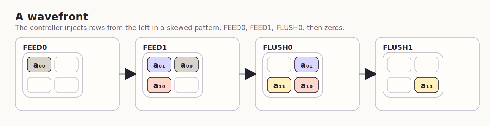
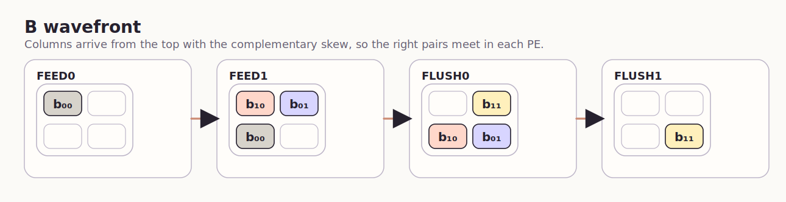
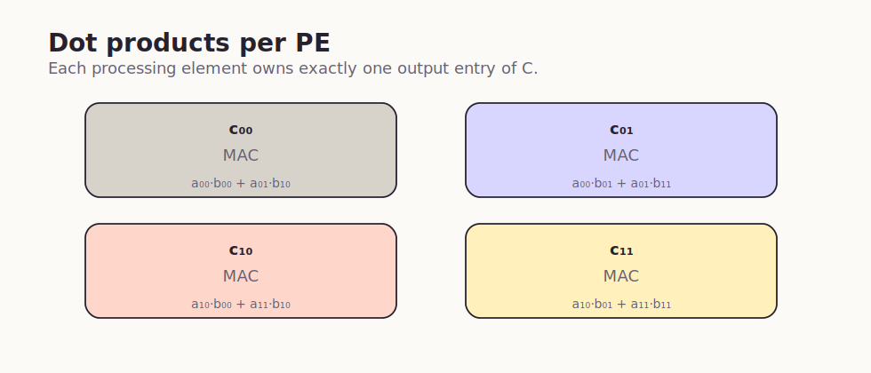

# tinytapeout-transformer

TinyTapeout for a chip that can run layers of a *very simple* transformer:
- 2x2 matmuls with accumulation*
- elementwise add
- ReLU
- right shift

(if your transformer does int-attention** instead of softmax-attention 😅)

## Systolic array

A 2×2 systolic array is the heart of the chip. Each PE owns one output entry, accumulates a 2-term dot product, forwards `A` horizontally, and forwards `B` vertically.







## Shapes and sizes

The design has two different scales:

- The physical macro is a narrow `1x2` Tiny Tapeout slot with a Sky130 footprint of `161.00 x 225.76 um`.
- The logical datapath is three 2x2 banks wrapped around the 2x2 PE array.
- Host-visible storage is signed `5b` for `A` and `B`, and signed `11b` for `C`.

## Datapath

The controller owns all state. It stores the three banks, decodes commands, generates the skewed systolic feed schedule, and multiplexes readback onto the output pins.

- `A[2][2]` and `B[2][2]` are the source banks.
- `C[2][2]` is the result bank.
- The systolic array has four identical MAC PEs.
- `OP_MATMUL` overwrites `C`.
- `OP_MATMUL_ACC` adds the new matrix product into the existing `C`.
- Elementwise ops only touch one `C[addr]` entry at a time.

## Matrix multiply inputs and outputs

The array computes:

| Output | Formula |
| --- | --- |
| `C[0] = c00` | `a00*b00 + a01*b10` |
| `C[1] = c01` | `a00*b01 + a01*b11` |
| `C[2] = c10` | `a10*b00 + a11*b10` |
| `C[3] = c11` | `a10*b01 + a11*b11` |

The row-major address map is fixed everywhere in the design:

| `addr` | Matrix entry |
| --- | --- |
| `0` | `[0][0]` |
| `1` | `[0][1]` |
| `2` | `[1][0]` |
| `3` | `[1][1]` |

Matrix-multiply operands should be requantized into the signed `-16..15` range before launch.

## Supported operations

| Execute op | Effect on `C` | Scope |
| --- | --- | --- |
| `OP_MATMUL` | `C = A x B` | whole 2x2 bank |
| `OP_MATMUL_ACC` | `C = C + (A x B)` | whole 2x2 bank |
| `OP_EW_ADD` | `C[addr] = A[addr] + B[addr]` | one word |
| `OP_EW_RELU` | `C[addr] = max(C[addr], 0)` | one word |
| `OP_EW_SHIFT` | `C[addr] = C[addr] >>> shift` | one word |

Notes:

- Add and accumulate wrap in signed `11b` arithmetic.
- Shift is arithmetic right shift.
- Commands issued while `busy=1` are ignored.

## Controller state machines

The host-visible behavior is simple:

- `IDLE` is the only state that accepts a command.
- Write and read commands are handled directly in `IDLE`.
- Elementwise execute commands go through a one-cycle `EXEC` state.
- Matmul commands walk the full systolic schedule before returning to `IDLE`.

## Matmul schedule

One matmul launch always uses the same internal sequence:

| State | Role |
| --- | --- |
| `CLEAR` | clear all PE accumulators |
| `FEED0` | inject the first skewed wavefront |
| `FEED1` | inject the second skewed wavefront |
| `FLUSH0` | inject the final nonzero values for the bottom-right PE |
| `FLUSH1` | drive zeros and drain the pipeline |
| `LATCH` | capture `array_c00..array_c11` into `C` |

That fixed schedule is why the external interface can stay tiny while the internal math still behaves like a real systolic array.

## External command interface

### Input pins

| Pin | Meaning |
| --- | --- |
| `ui_in[7:0]` | command payload |
| `uio_in[0]` | `cmd_stb`, pulse high for one cycle |
| `uio_in[2:1]` | `cmd` |
| `uio_in[4:3]` | `addr` |
| `uio_in[6]` | auxiliary write bit, unused in the default `5b` operand mode |

### Output pins

| Pin | Meaning |
| --- | --- |
| `uo_out[7:0]` | low `8b` of the selected readback chunk |
| `uio_out[7]` | high bit of the selected readback chunk |
| `uio_out[6]` | always `0` |
| `uio_out[5]` | `busy` |

Interpret each returned chunk as `{uio_out[7], uo_out[7:0]}`.

### Command encoding

| `cmd` | Meaning |
| --- | --- |
| `2'b00` | write `A[addr] <= ui_in[4:0]` |
| `2'b01` | write `B[addr] <= ui_in[4:0]` |
| `2'b10` | execute operation encoded in `ui_in` |
| `2'b11` | select which bank, address, and read chunk appear on the output bus |

### Read bank select

For `cmd=2'b11`, `ui_in[1:0]` selects the source and `ui_in[7:2]` selects the chunk:

| `ui_in[1:0]` | Read bank |
| --- | --- |
| `0` | `A` |
| `1` | `B` |
| `2` | `C` |

Default chunk usage:

- `A` and `B` only use chunk `0`.
- `C` chunk `0` returns bits `[8:0]`.
- `C` chunk `1` returns bits `[10:9]` in the low bits of the 9-bit read bus.

### Execute payload

For `cmd=2'b10`:

| Bits | Meaning |
| --- | --- |
| `ui_in[2:0]` | operation |
| `ui_in[3]` | reserved |
| `ui_in[7:4]` | shift amount for `OP_EW_SHIFT` |

# Quickstart

Initialize the `tt` submodule first. You will need `uv`, `iverilog`, `verilator`, and `yosys` installed locally. Then run:

```sh
uv sync
uv run make test
uv run make lint
uv run make synth
```

The Python training and inference tools now use this same root environment:

```sh
uv run python -m ttt.train --steps 200
uv run python -m ttt.quantize
uv run python -m ttt.sample --backend int5_ref
uv run python -m ttt.sample --backend chip_sim
uv run python -m ttt.sample --backend pcb --pcb-port /dev/cu.usbmodemXXXX
```

More detail lives in `python/README.md`.

*the host has to tile these!
**floating point numerics take up a lot of gates, so we do `ReLU(QKᵀ)V` for attention instead of the instead of the usual `softmax(QKᵀ)V`
